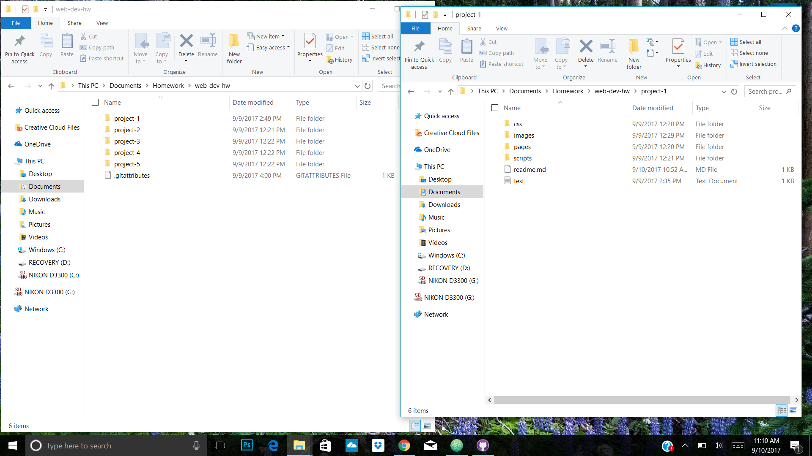

# My First README.md
## Jessica Mittal-Lohse
**Thoughts about this assignment:**
- I was a little confused about the assignment at first.
- I orginally thought it was going to be *very difficult* to accomplish anything, but it wasn't too bad.
- I've already learned a lot and we are only a few days in. Such as:

1. How to name files
2. Not to use strange characters and spacing
3. However I'm `still not sure what code or code block is`

 ***
Learning the Markdowns is going to take a while.
[This Markdown page will help a lot!](https://guides.github.com/features/mastering-markdown/)
***

I was having a hard time linking the screenshot but i finally figured it out!
The changes are not showing up 
