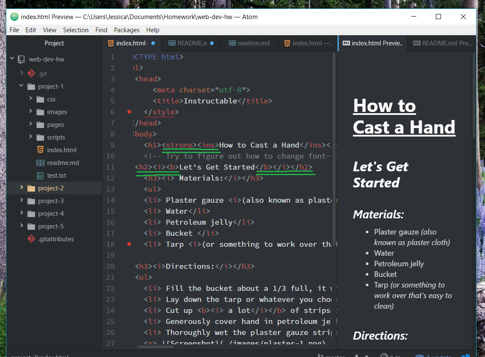

**Thoughts about Project 2:**
- I was surprised to discover how much I already forgot about what we learned. I actually had to review a lot and ended up writing pages of notes.
- I truly hope that with time I will start remembering some of the coding and little rules.
- I'm still not sure if there is a certain order that the coding is to follow. such as does < i > ... < /i > come before < b >..< /b > if I wanted to use both?

- I still need work on creating proper struture and having it look clean on the screen.

---
**Project 2 Part 2**
- This week I struggled a lot. It was mainly with the images. In the end I feel like I kind of cheated. I ended up uploading the images to my artist website just so the images would have a valid URL. I for some strange reason could not have them work if I was going though my project-2 images folder.
- I also keep having issues with my my form page. At first it would almost blink and then there would be nothing. I just did some minor edits and it somehow fixed it.
- I feel this week we had a lot thrown at us. For sure learned the most this week, but I am glad that my site is slowly looking better and better. It is mindblowing how much coding can go into, what many believe, a simple thing. For example, the form page with uploading an image or creating a checkbox. So much little detailed coding is needed for something that takes the user seconds to operate.
- One thing I would like to learn would be how to change fonts. I know we can with the opening coding. But, I'm not sure where we find the right names for the fonts.

---
**Project 2 Part 3**
- Again this week we learned a lot. I am having issues with the audio and video and can not figure out the reason why my files are not working and are not linking from my computer. If I take the files from online then they work but if they come directly from me they only partially work. I am not sure if it has something to due with the path it is trying to take to the files and something is just not typed out correctly.
- below the screenshot first shows that it looks fine but once I press play it does not work. Still trying to figure out why this is.

- I do feel over all I am learning a lot and learning some amazing skills such has how to create links to go to one page to another. I can't wait until I can really work on the skills and make them better, getting better at the basics.
