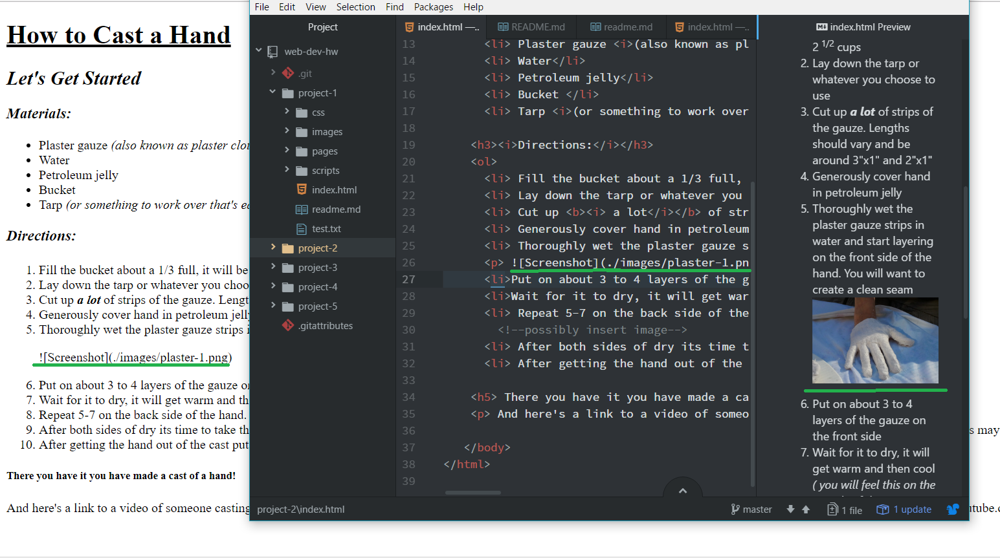

**Thoughts about Project 2:**
- I was surprised to discover how much I already forgot about what we learned. I actually had to review a lot and ended up writing pages of notes.
- I truly hope that with time I will start remembering some of the coding and little rules.
- I'm still not sure if there is a certain order that the coding is to follow. such as does < i > ... < /i > come before < b >..< /b > if I wanted to use both?

-I still need work on creating proper struture and having it look clean on the screen. Another concern I had was about how to a photo to the live site. I realized it doesn't work the same as the readme. It worked when looking at it though the index preview but it didn't show up on the site.

`After looking through the book I figured out how to do the image, I'm guessing this is something that we will be learning later.`
