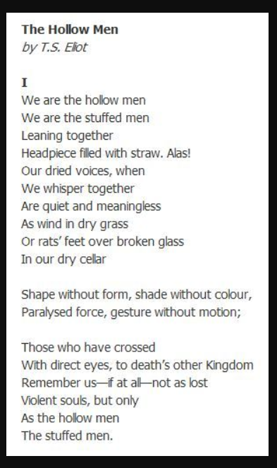
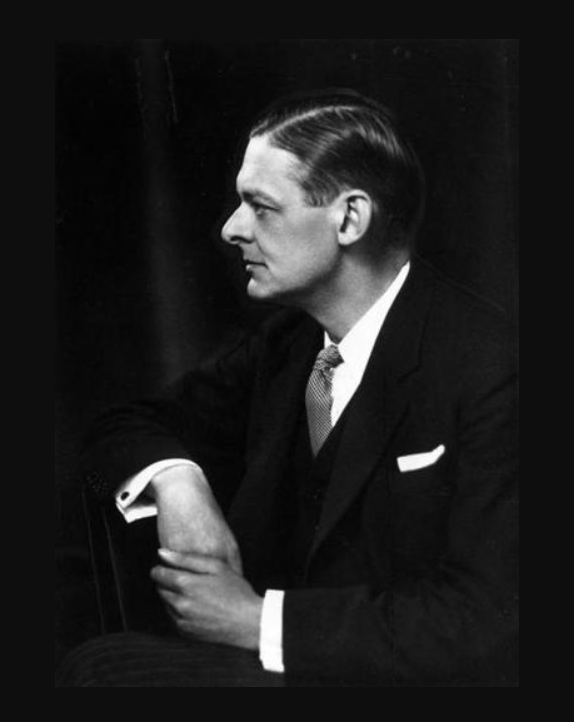
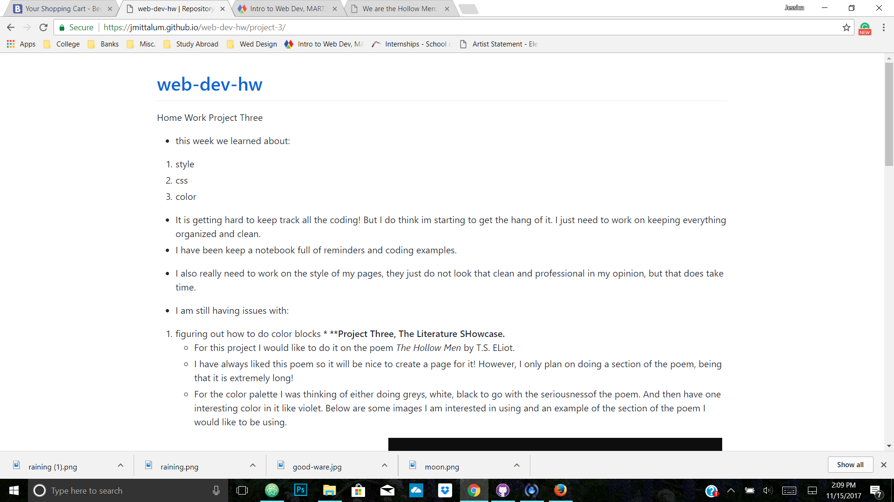
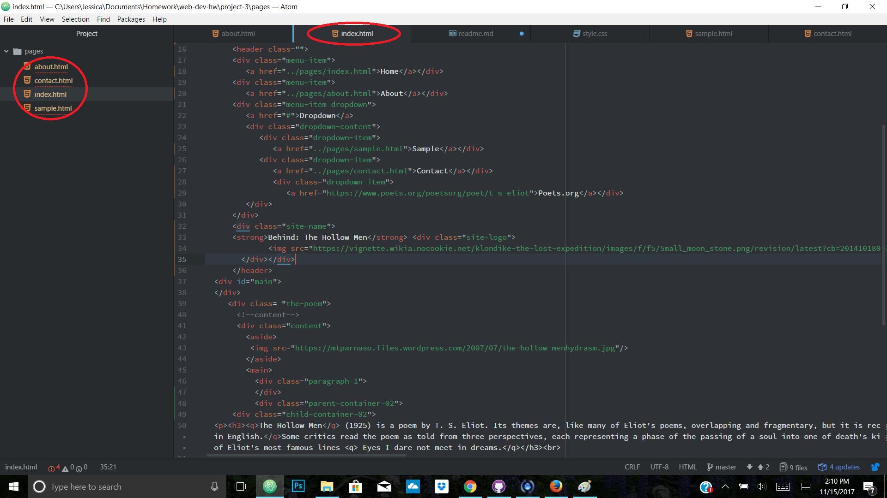

Home Work Project Three

- this week we learned about:

1. style
2. css
3. color

- It is getting hard to keep track all the coding! But I do think im starting to get the hang of it. I just need to work on keeping everything organized and clean.
- I have been keep a notebook full of reminders and coding examples.
- I also really need to work on the style of my pages, they just do not look that clean and professional in my opinion, but that does take time.

-  I am still having issues with:

1. figuring out how to do color blocks
***
**Project Three, The Literature Showcase.**
- For this project I would like to do it on the poem *The Hollow Men* by T.S. ELiot.
- I have always liked this poem so it will be nice to create a page for it! However, I only plan on doing a section of the poem, being that it is extremely long!
- For the color palette I was thinking of either doing greys, white, black to go with the seriousnessof the poem. And then have one interesting color in it like violet. Below are some images I am interested in using and an example of the section of the poem I would like to be using.

---
Style Plan
The grey tones I used.
For images I went with ones that were on the darker side to possbily compliment the lighter tones of the background.

---
**Project Three Part 2**
- I truly struggled with getting links to other pages to work, iamges to work, blocks, and fonts
- I mainly had problems with getting the fonts to work and it still is not how I would like it to be, but after spending 3 hours on just trying to figure out how to use fonts in the main text and it not working, I gave up.
- I am now having issues publishing my live site, it now will go to my readme page and I do not know if I will be able to get this figured out.
- Over all this was a very very frustrating assignment and I wish that I started 3 days ago instead of 2. I feel that if I had gave myself that extra time it would have been less stressful.
- After reading the help section I still have not found guidence on why I am having such issues with my fonts and why I am unable to publish/see my live site.

***
**Project Three: Homework 06**
**Struggles**
- This week I am still struggling with my live site showing up instead of my Readme. I am not sure why it is bouncing back to this, being that I have an index page. The only thing I can think of is it is placed in the wrong folder.

- I also was having issues with the logo, it would show up everywhere else except the place I wanted it to. I assume this is because my title is not in my header.
- I also had issues trying to figure out how to do a side menu, in the end I gave up on that.

**Result**
- I do think my site is slowly looking better but there are still things I would like to work on. I do have some missing elements to the homework and do not know how to resolve them at the moment.
- This weeks homework was a little easier to understand and I think I accomplished a lot more. It is hard to keep up with all that is required and having the coding neat-ish.
-
