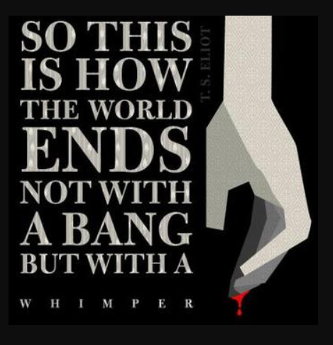
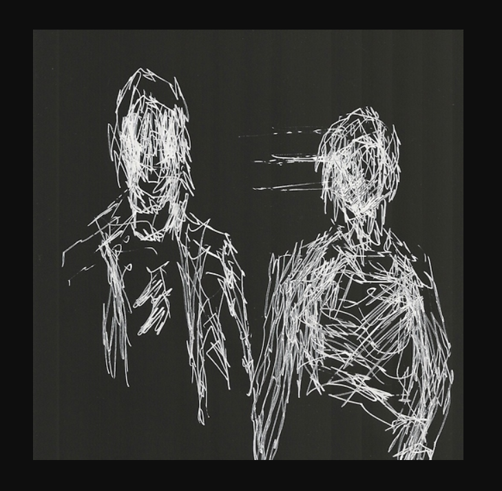

## Project 3
**learning about CSS**
-This week we learned about style, css, color and more. It is getting hard to remmeber all the coding for this information and how it all is going to be set up. Really interested in doing the project, its jsut going to take a lot.
-I find it interesting that you can just think of a color and usually it work for the style. That it doestn ahve to be as siple as blue or green but can be, limegreen, or violet, etc.
- I can't wait to really start this project, but I am a little worried about how much is needed to be coded for this! It is going to be intense.
***
**Idea for Project 3, The Literature SHowcase.**
- For this project I would like to make a page on the poem *The Hollow Men* by T.S. ELiot.
- I have always liked this poem so it will be nice to create a page for it! THere is also a  lot that I can use and find out about the poem so it makes the reasearch part of the assignment a little easier. I also dont htink I will have the whole poem typed out, being that it is extremely long.
- For the color palette I was thinking of either doing greys, white, black to go with the seriousness, darkness of the poem. Maybe have one interesting color in it like violet. or a red.
-Below are some images I am interested in using, and the section of the poem I would like to focus on.

