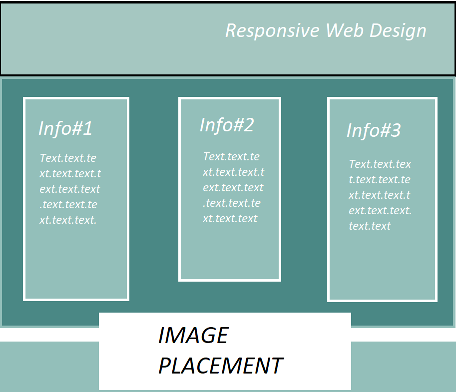

**Homework for Project 4**
- This week we went over Responsive Web Design and what that means and what it is good for.
- Responsive Web Design:
1. Makes it possible for the design to work on multiple platforms, this ranges from Iphones, Macs, and different browers.
2. Responsive Web Design should be used with all coding projects so others may see the design correctly.

**Struggles**
- Trying to insert an image into the footer, for some strange reason it wanted to go off to the side like it was an aside. Did not reslove this but I do plan on going back and adding more information and putting in everything that I wanted.
**Project 4 Layout**
 
 - I wanted to use a softer color palette and thought blues, greys, and white would accomplish that.
 - I did want to insert a image but could not figure out how to insert it into the footer without it distoring the rest of the page.
 - I stayed simple with this page being that there was not a lot of information needed for the page.
 - I do plan on editing this later and maybe making it a little bit more interesting. It is a little plain.
